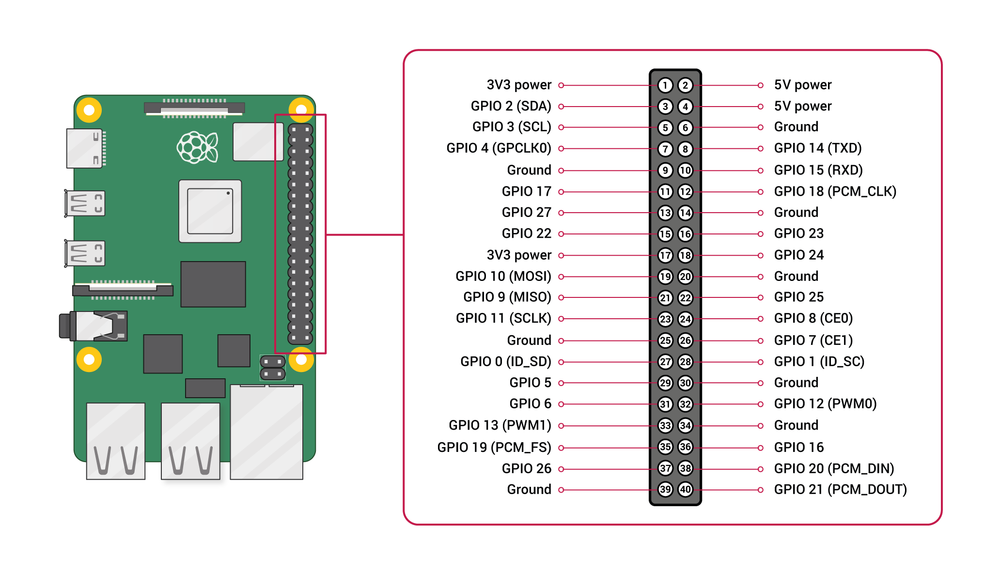

This page details how to use the [Raspberry Pi Debug Probe](https://www.raspberrypi.com/products/debug-probe/).


# USB Connection

The debug probe is connected to the computer using a usb cable.

Under Linux the probe should appear under ```/dev/ttyACM0```.

In case ```/dev/ttyACM0``` does not show up when plugging the probe, make sure the [CDC ACM driver](https://github.com/torvalds/linux/blob/master/drivers/usb/class/cdc-acm.c) is present. The line ```CONFIG_USB_ACM=m``` should be present in ```.config``` when compiling the kernel.


# Raspberry Pi 3 or 4

We use the UART port on the probe that we connect to the following GPIO pins as shown in the photo below.


GPIO pins are labelled as shown below on Raspbetty Pi 3 or 4.



The 3-pin debug cable to 0.1 jumper (female) connects the probe to the GPIO. The black cable, ground, is connected to pin #6. Yellow cable (RX/SD) is connected to  pin #8 labelled GPIO 14 (TXD) on the Raspberry Pi. Orange cable(TX/SC) is connected to pin #10 labelled GPIO 15 (RXD) on the Raspberry Pi.

On the Raspberry Pi UART is not enabled by default. Make sure that in the file ```/boot/firmware/config.txt``` there is:
```
[all]
enable_uart=1
```
Otherwise add these two lines. Then reboot the Raspberry Pi.

Then on the computer connected by USB type:
```
sudo apt install screen
sudo screen /dev/ttyACM0 115200
```

It's then possible to connect from the computer, using login and password of a user on the Raspberry Pi.

# Vision Five 2

Here is how to plug the cables on a [Vision Five 2](https://www.starfivetech.com/en/site/boards):


# W5500-EVB-Pico

UART can be accessed on the [w5500-evb-pico](https://docs.wiznet.io/Product/iEthernet/W5500/w5500-evb-pico) either via GPIO pins using the Raspbetty Pi probe or directly via USB. The two modes are described below.

## UART via GPIO
The corresponding device tree should be used for Zephyr:
```dts
/ {
	chosen {
		zephyr,console = &uart0;
		zephyr,shell-uart = &uart0;
	};
};

&uart0 {
	current-speed = <115200>;
	status = "okay";
	pinctrl-0 = <&uart0_default>;
	pinctrl-names = "default";
};
```

GPIO pins GP0 GP1 and GND should be used to connect to UART for w5500-evb-pico as shown in pictures below.


## UART via USB

To use USB to connect to UART for [w5500-evb-pico](https://docs.wiznet.io/Product/iEthernet/W5500/w5500-evb-pico), the corresponding device tree should be used for Zephyr:
```dts
/{
  chosen {
    zephyr,console = &cdc_acm_uart0;
    zephyr,shell-uart = &cdc_acm_uart0;
  };
};

&usbd {
  status = "okay";
  cdc_acm_uart0: cdc_acm_uart0 {
    compatible = "zephyr,cdc-acm-uart";
    label = "CDC_ACM_0";
  };
};

&uart0 {
  status = "disabled";
};
```

The following ```prj.conf``` options should be selected:
```ini
# USB stack
CONFIG_USB_DEVICE_STACK=y
CONFIG_USB_DEVICE_INITIALIZE_AT_BOOT=y

# USB CDC ACM serial device
CONFIG_USB_CDC_ACM=y

# Console and logging
CONFIG_SERIAL=y
CONFIG_CONSOLE=y
CONFIG_UART_CONSOLE=y

# Optional logging
CONFIG_LOG=y
CONFIG_LOG_BACKEND_UART=y
```

# RPi-Pico


# Arduino Nano 33 IoT


