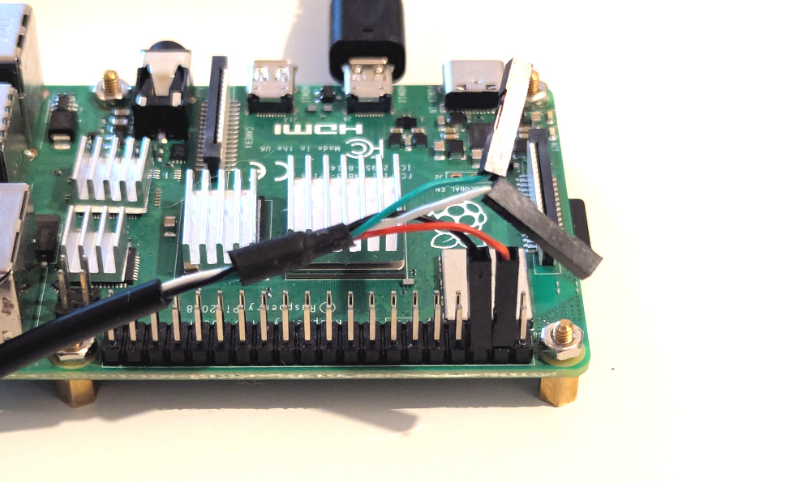

This page details how to use the [Raspberry Pi](https://www.raspberrypi.com/) 4 or 5 as a USB device.

# Powering the Raspberry Pi

The USB connection might not be enough to power the Raspberry Pi. So we need to directly power the Pi. This can be done by plugging pins 4 to 5V and pin 6 to ground.

Here is an example of direct powering of Rasberry pi:

# USB Connection
