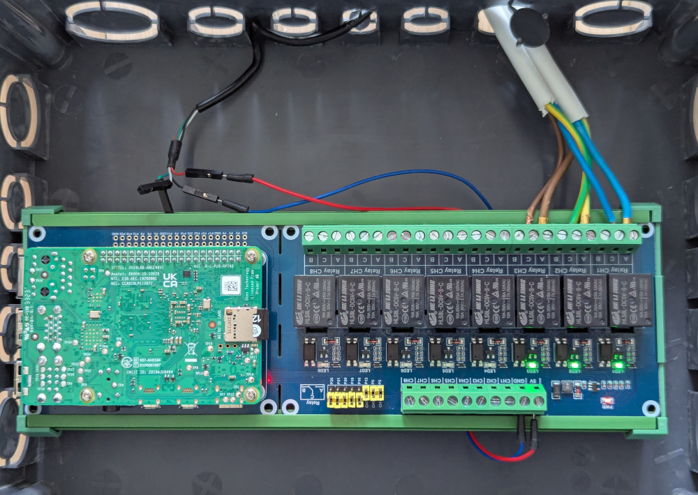

This page details how to use the [Raspberry Pi](https://www.raspberrypi.com/) 4 or 5 to control electrical devices using relays.

# Hardware used

This uses a Raspberry Pi 4, [USB breakount cable](https://www.adafruit.com/product/4448) and a [Raspberry Pi 8-ch Relay Expansion Board](https://www.waveshare.com/rpi-relay-board-b.htm).

# Powering the Pi

The Red (+5V) and Black (Ground) cable from the USB breakount cable are plugged in corresponding location in the Relay Expansion Board:

